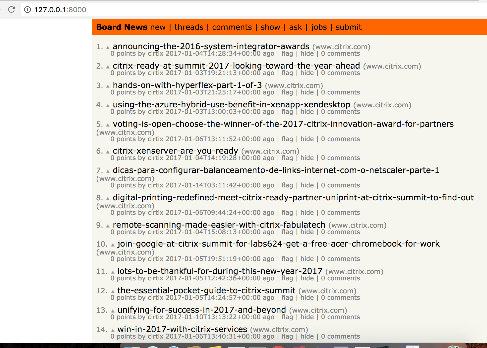

#My TechBoard

My TechBoard is a HackerNew style website which show the news crawling from [Citrix Blog](https://www.citrix.com/blogs/), [HackerNews](https://news.ycombinator.com/news) and [stackoverflow](http://stackoverflow.com/?tab=week).

A scrapy spider is used to crawl the title and URL of the news, and the detail items will be stored in mongodb and render with Flask.

## Scrapy operation

* pip install scrapy
* scrapy createproject TechBoard
* scrapy crawl hackernews

##Mongodb

* brew install mongodb
* start mongod
    * mongod --config /usr/local/etc/mongod.conf
* test mongodb
    * mongo
    * db.test.insert({'name':'test'}) WriteResult({ "nInserted" : 1 })
    * db.test.find()

## Web

* pip install flask
* pip install mongoengine
* pip install flask-mongoengine
* python run.py